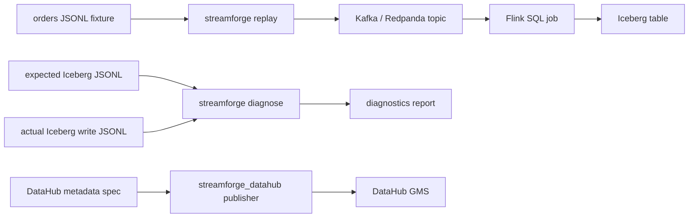

# Architecture

StreamForge is split into four small layers:

1. Replay fixture loading and Kafka publishing.
2. Flink SQL that reads replayed events and writes an Iceberg table.
3. Diagnostics that compare expected replay records with actual Iceberg write evidence.
4. DataHub publishing for catalog metadata, lineage, ownership, schema history, and quality checks.

## Data Flow

## Record Matching

Diagnostics match expected and actual records by `record_id`. Each finding carries the trace fields needed to explain what happened:

- Kafka topic, partition, offset, and key
- replay run id
- producer name
- event time and write time
- payload hash
- Iceberg snapshot id and data file path

This keeps the report actionable when a replay surfaces missing, late, duplicate, mismatched, or unexpected rows.
